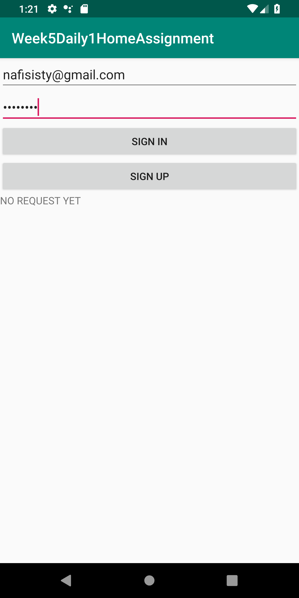
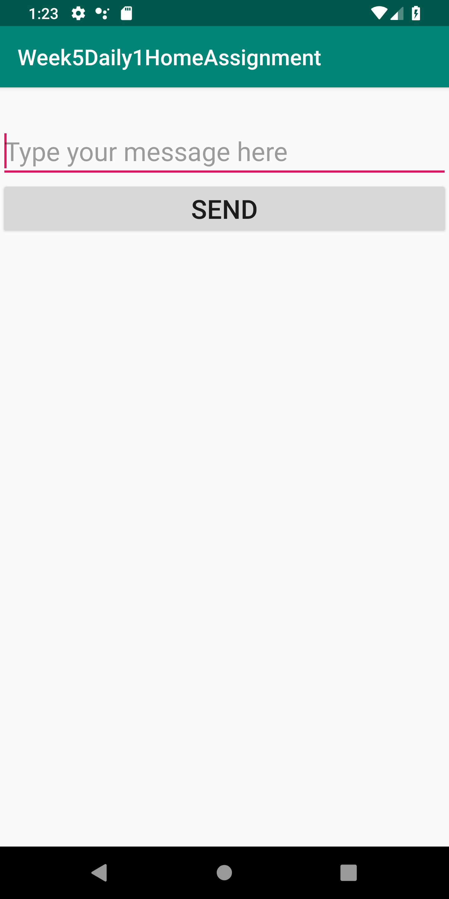
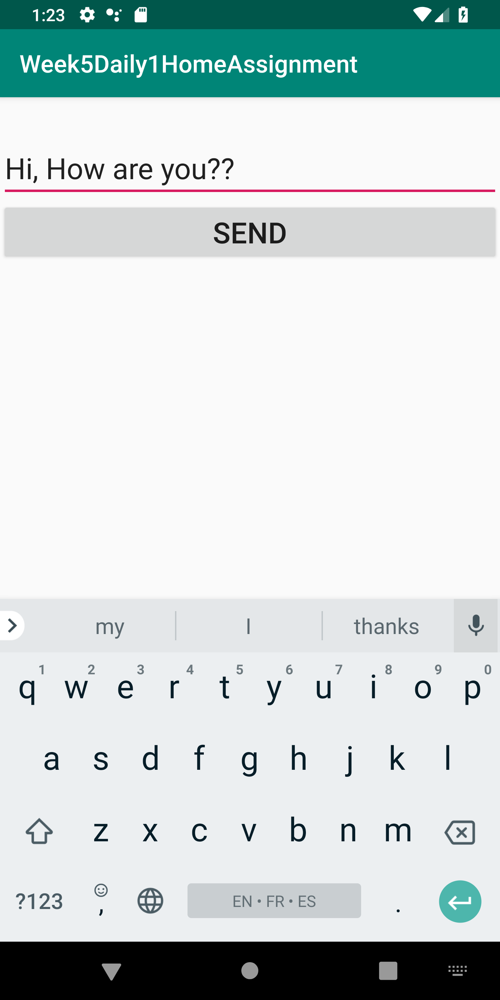
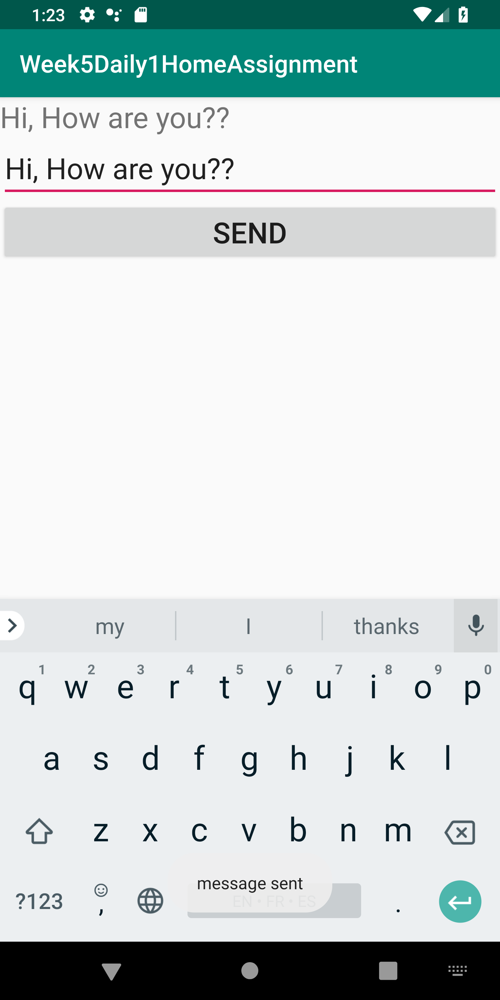
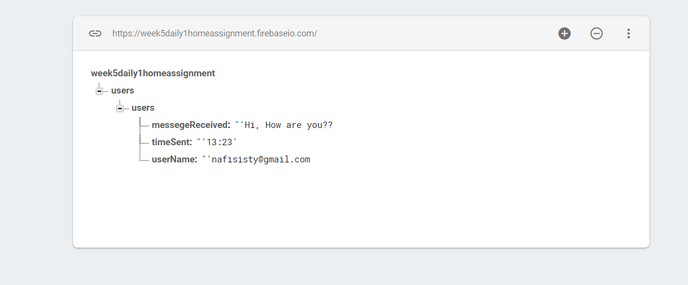
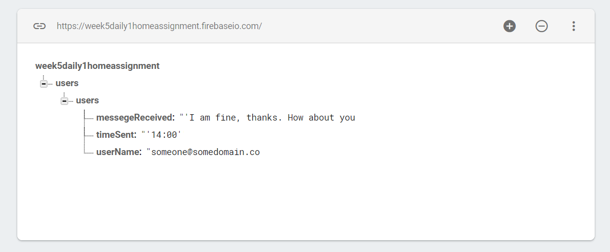
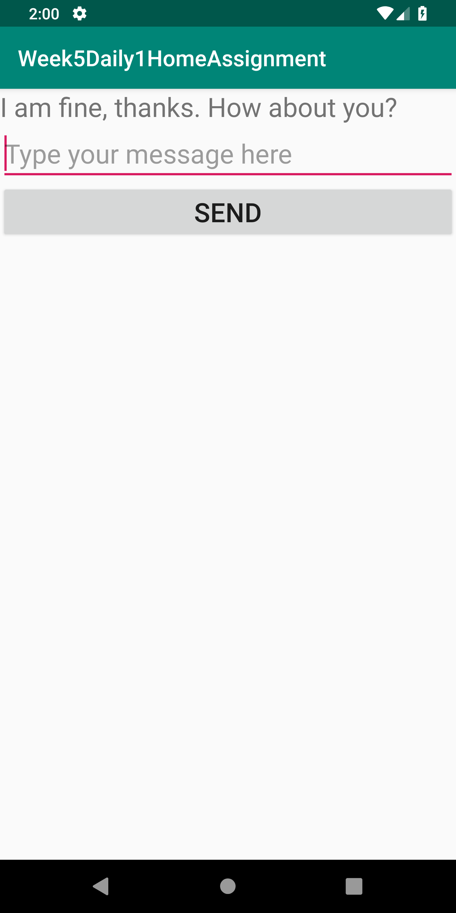
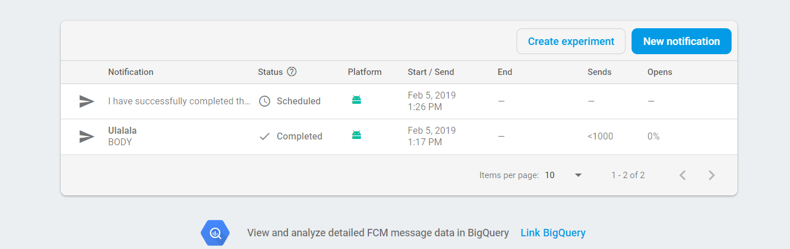
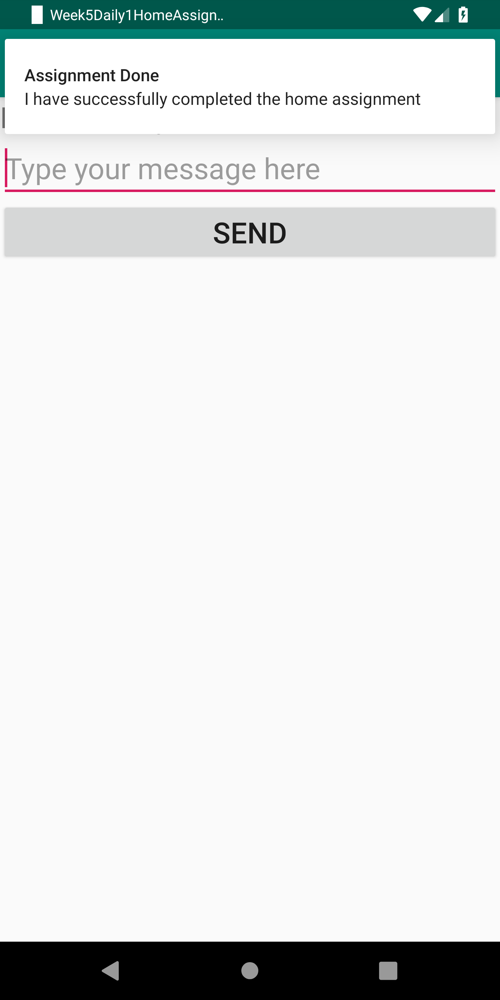
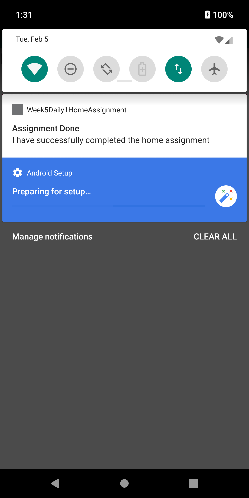

# Week5Daily1HomeAssignment
Create a chat application using firebase database.  The application should have the username, time sent, and message received.  Also the app needs to have the ability to receive push notifications via Firebase Cloud Messaging.  Include screenshots in the readme of all items working.

Loggin In.

As there is no data in firebase database, nothing is showing.

Typing message to start chat.

Message Sent.

Sent message is stored in database.

Now providing new message which should be sent to the application.

New message is shown in the application.

Notification sent from the Firebase.

Got the notification.

In the notification bar, the pushed notification is showing.

